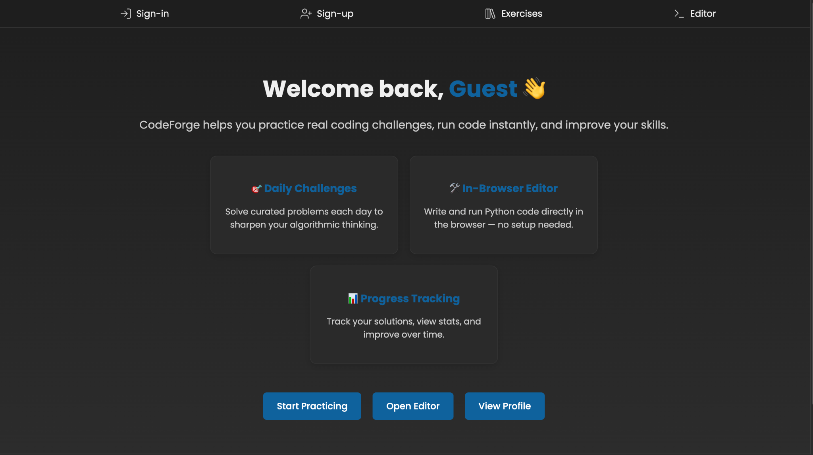
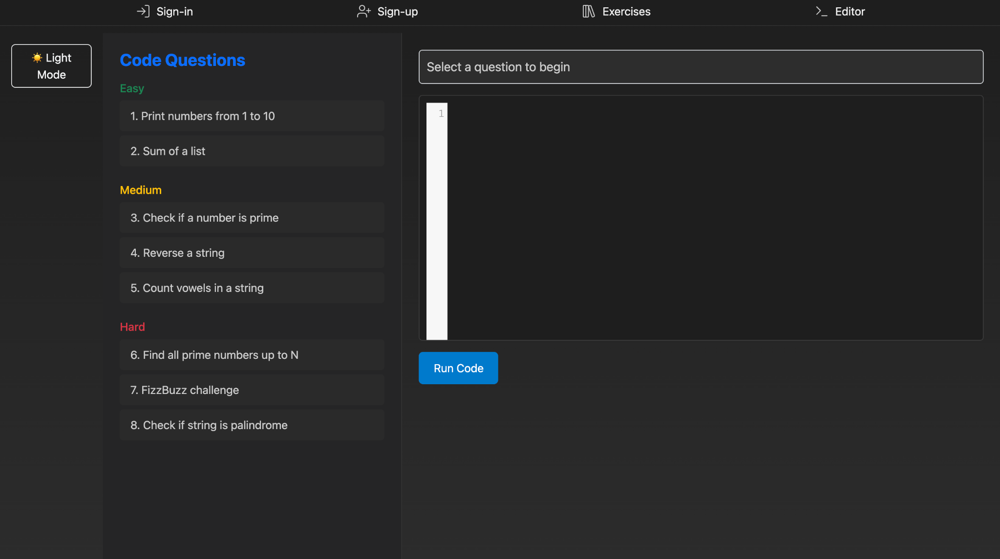
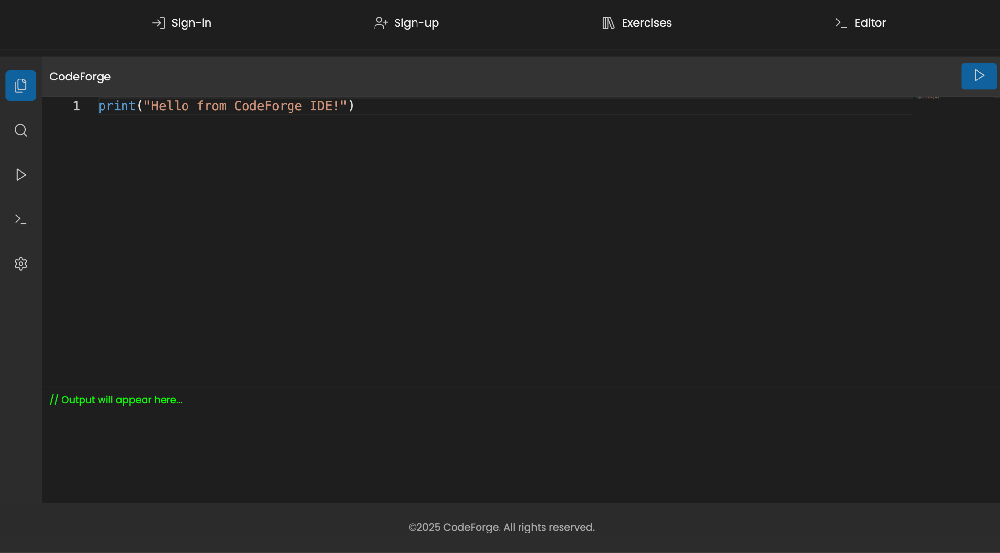

# 💻 CodeForge

CodeForge is a platform for solving coding challenges by level, designed to help users practice and improve their programming skills.  
It also includes a built-in online **code editor** for live execution and testing.

---

## 🚀 Live Website

👉 [https://codeforge-doag.onrender.com](https://codeforge-doag.onrender.com)

---

## 🛠️ Technologies Used

---

## 📂 Features

- 🧠 Solve coding exercises categorized by difficulty
- 👤 User authentication + Guest mode
- 🧪 Built-in Monaco-based code editor with Python execution
- 📈 Progress tracking and daily challenges
- 📱 Fully responsive for desktop and mobile

---

## 📸 Screenshots

### 🟢 Landing Page

### 🏠 Home Page (Guest Mode)

### 📚 Exercise Page

### 🖊️ Online Code Editor (IDE)

### 📝 Sign Up Page

